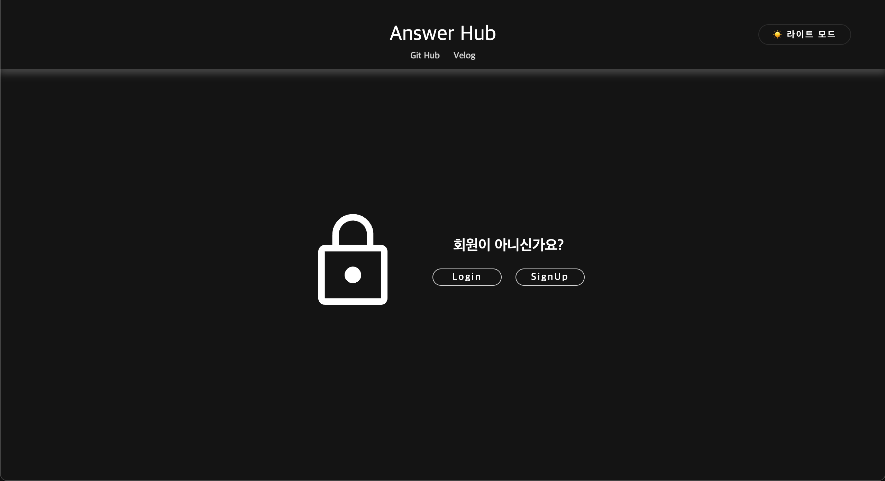

Answer Hub

  
   

html, css, js과 Local Storage를 사용해 구현한 Answer Hub, 질문 모음공간 입니다.
  

 

[데모 바로가기](https://notice-board-mu.vercel.app/)

## 기능 목록

|                                                                                          |
| :--------------------------------------------------------------------------------------: |
| 다크모드 , 회원가입 , 로그인 , 아이디 찾기 , 패스워드 변경 , 회원탈퇴 , 글쓰기 , 글 삭제 |

 

## 세부사항

|                                                                           |
| :-----------------------------------------------------------------------: |
|      회원가입시 이미 존재하는 아이디 검사, 유효성 검사를 실시합니다       |
|              로그인시 아이디와 패스워드의 길이를 검사합니다.              |
|           아이디 찾기시 아이디와 패스워드의 길이를 검사합니다.            |
|           로그인시 내 정보인 마이 페이지를 확인할 수 있습니다.            |
|       로그인 상태를 저장하여 로딩되더라도 로그인 상태를 유지합니다.       |
| 비밀번호 변경시 현재 비밀번호를 확인하고 변경할 비밀번호를 입력 받습니다. |
|             회원 탈퇴시 해당 회원이 작성한 글들을 삭제합니다.             |
|                   회원 탈퇴시 유저 목록에서 삭제합니다.                   |
|                 글 삭제는 작성자 본인만이 할 수 있습니다.                 |

